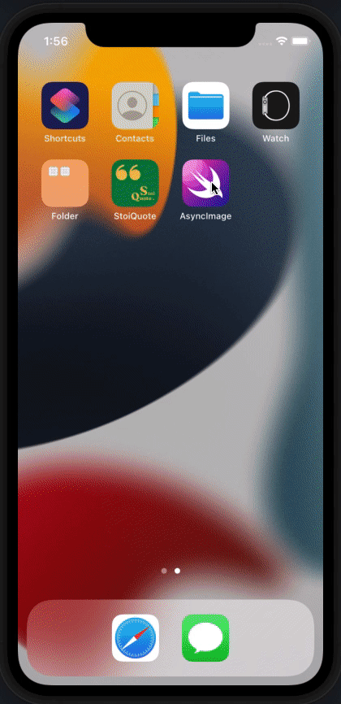

    
    
    
    

# AsyncImage
A simple app that displays image from a URL using AsyncImage.

### 🏙 Screenshots

#### App Demo

### 📚 Learnings

- Use of SwiftUI AsyncImage from basic to scaling the image, creating a placeholder in case of error, handling phases and animating the image.
- Creating a reusable image extension to avoid duplication of modifiers. 

### 👨🏻‍⚖️ Disclaimer

> This is posted as a way to share SwiftUI learnings at Credo Academy (and is not production level code) and in the hopes that other iOS developers may use the app themselves. Use it at your own risk.

